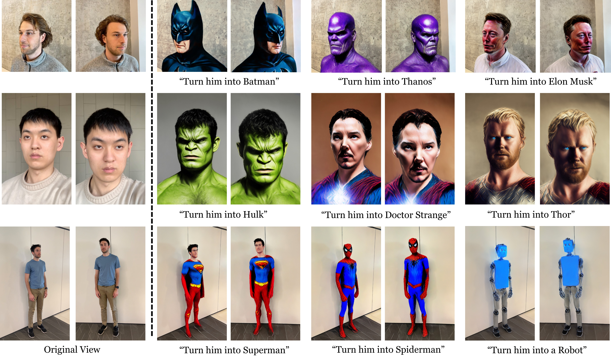
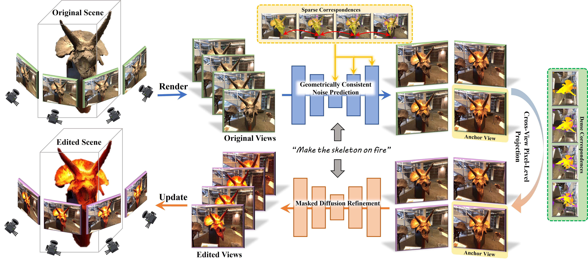

# SyncNoise: Geometrically Consistent Noise Prediction for Text-based 3D Scene Editing

### [Paper](https://arxiv.org/abs/2406.17396) | [Project Page](https://lslrh.github.io/syncnoise.github.io/)

This repo is the official implementation of the work [SyncNosie](https://lslrh.github.io/syncnoise.github.io/).

Edited results by SyncNoise, which achieves high-quality and controllable editing that closely adheres to the instructions with minimal changes to irrelevant regions. SyncNoise attains geometrically consistent editing without compromising fine-grained textures.

## Abstract
We propose SyncNoise, a novel geometry-guided multi-view consistent noise editing approach for high-fidelity 3D scene editing. SyncNoise synchronously edits multiple views with 2D diffusion models while enforcing multi-view noise predictions to be geometrically consistent, which ensures global consistency in both semantic structure and low-frequency appearance. To further enhance local consistency in high-frequency details, we set a group of anchor views and propagate them to their neighboring frames through cross-view reprojection. To improve the reliability of multi-view correspondences, we introduce depth supervision during training to enhance the reconstruction of precise geometries. Our method achieves high-quality 3D editing results respecting the textual instructions, especially in scenes with complex textures, by enhancing geometric consistency at the noise and pixel levels. 

## News
- **2024.06.20**: Repo is released.

## TODO List
- [ ] Code Release
- [ ] SyncNoise-NeRF-Edit
- [ ] SyncNoise-GS-Edit
- [ ] SyncNoise-CosXL

## Citation
If our work is useful for your research, please consider citing:

@article{li2024syncnoise,
  title={SyncNoise: Geometrically Consistent Noise Prediction for Text-based 3D Scene Editing},
  author={Li, Ruihuang and Chen, Liyi and Zhang, Zhengqiang and Jampani, Varun and Patel, Vishal M and Zhang, Lei},
  journal={arXiv preprint arXiv:2406.17396},
  year={2024}
}

## Acknowledgement
This project is based on [NerfStudio](https://github.com/nerfstudio-project/nerfstudio), [Instruct-Nerf2Nerf](https://github.com/ayaanzhaque/instruct-nerf2nerf), and [Efficient-Nerf2Nerf](https://github.com/gong-xuan/nerfstudio-en2n). Thanks for their awesome work.

